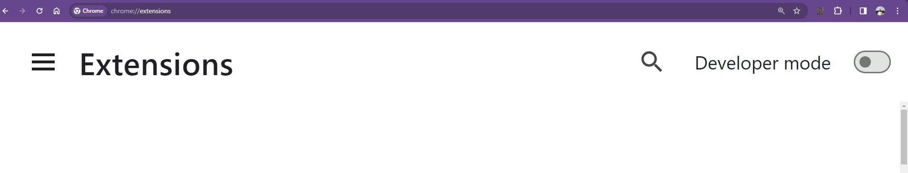
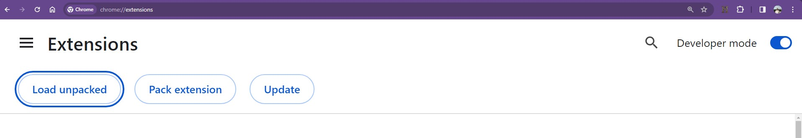

<h1> Unfortunately google shut down their web caches so this extension is not working anymore</h1>
<h1 align="center">
  <br>
  <a href="https://github.com/TolunayM/premedium"></a>
  <br>
    PreMedium
  <br>
</h1>


<h4 align="center">Small Chrome extension for bypass medium paywall.</h4>

## How To Install


```bash
# Clone this repository
$ git clone https://github.com/TolunayM/premedium

# Open your browser go
chrome://extensions
```



<strong>After that turn on your developer mode and press load unpacked</strong>




<strong>And select premedium folder</strong>

You can pin to your extension bar for easy access if you wish.

## How To Use
    I strongly recommend use this extension with any reader mode extension. This extension is not for visual purposes it's only for paywall.

    I'm using Clearly Reader and it's great even on free tier.

<a href= "https://chromewebstore.google.com/detail/clearly-reader-your-reade/odfonlkabodgbolnmmkdijkaeggofoop?hl=tr">Clearly Reader</a> 

If you encounter an article for premium users only just click extension icon from extensions bar. After that you can use your reader extension as same as it before. Just use premedium extension first.

## Built With

Javascript

## License
GNU
